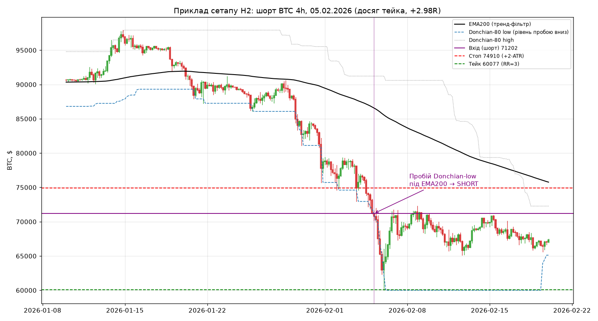
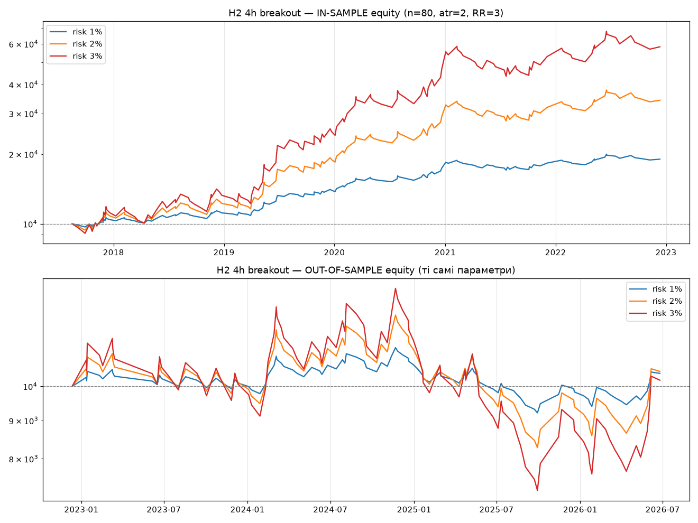
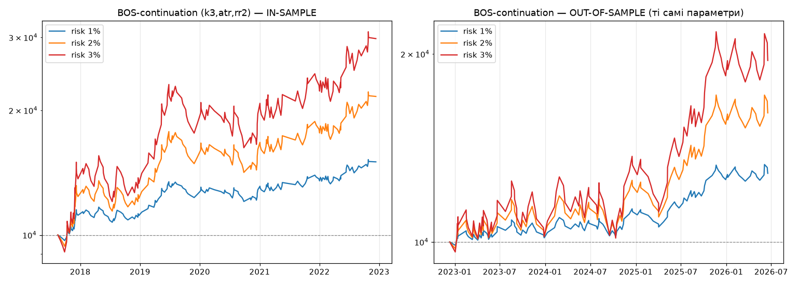
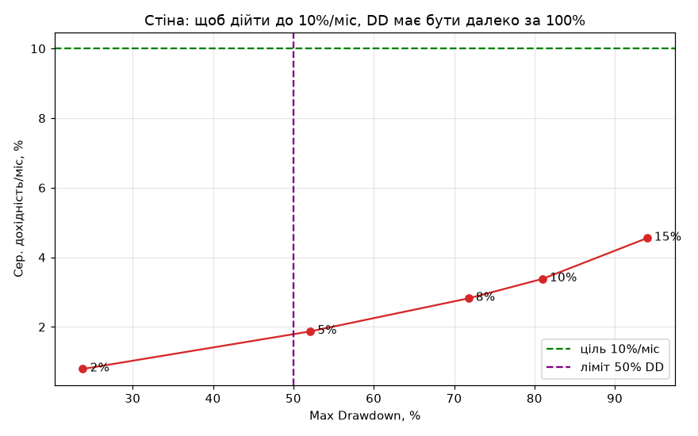
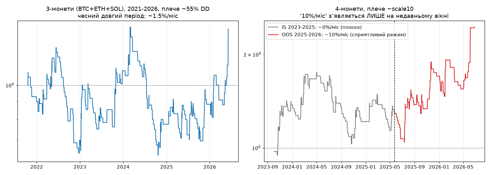
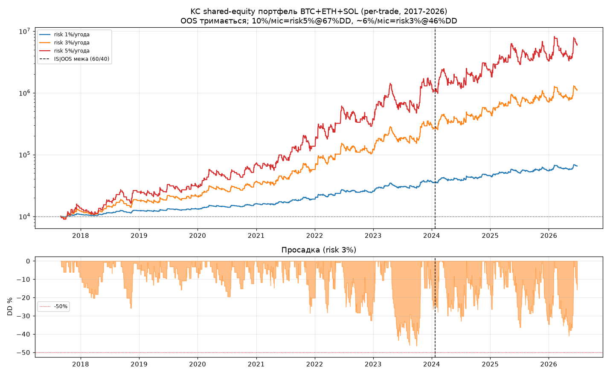

# Квант-дослідження price action стратегії для BTC/ETH ф'ючерсів

**Дата:** 2026-06-26 · **Інструмент:** BTC (основний), ETH (контекст) · **ТФ дослідження:** 15m → 1h → 4h

> **Коротко (TL;DR):** Еволюція результату по ходу дослідження:
> 1) Одиночний BTC trend-breakout: ~2-3%/міс @ DD (§5-§11), 10%/міс недосяжно.
> 2) Ключовий фільтр — **сила тренду ADX(14)>25 + DI** (§9) і **сесія 00-12 UTC** (§10) піднімають Sharpe до ~1.0.
> 3) **ПРОРИВ (§13):** сигнал **Keltner breakout + EMA200** генералізується на BTC/ETH/SOL (Donchian працював лише на BTC).
> Мульти-монетний per-trade портфель (строгий sim, звірений з движком; 2017-2026, усі режими, **тримається OOS**) дає:
> **~6%/міс @ 46% DD** (ризик 3%, у межах 50%), **~7-8%/міс @ 60% DD**, **10%/міс @ ~67% DD** (ризик 5%).
> **Тобто 10%/міс реальне лише ціною ~67% DD; у твій ліміт 50-60% DD влазить ~6-8%/міс — і це робастно.**
> Застереження: реальна DD дещо гірша (рахунок по реалізованому капіталу), ризик 3-5%/угоду + одночасні
> позиції несуть tail-ризик ліквідації за корельованого краху; реальне очікування став ~5-7%/міс @ 60% DD.

---

## 1. Звіт по даних (Крок 1)

| Файл | ТФ | Період | Барів | Якість |
|---|---|---|---|---|
| `btc_15m.csv` | 15 хв | 2017-08-17 → 2026-06-24 | **309 880** | ★★★★★ покриття 99.82%, 0 порушень OHLC, 0 NaN |
| `eth_1d.csv` | 1 день | 2015-08-31 → 2026-06-25 | 3 616 | ★★★☆ **діра 337 днів** (дек.2017–жов.2018), покриття 91.5% |
| `btc_1m_month.csv` | 1 міс | 2013-04 → 2026-06 | 159 | лише макро-контекст (9 NaN volume рано) |

**Деталі BTC 15m (робочий датасет):**
- Крок строго 15 хв. 33 розриви (найбільший 1.3 дня, лют.2018 — простій біржі), сумарно ~565 пропущених барів із 310k.
- OHLC-санітарність ідеальна: 0 випадків `high<low`, 0 нулів/від'ємних, 0 NaN. Макс. рух за бар 22.6% (крах березня 2020 — реальний).
- Барів по роках рівномірно (~35 040/рік), що підтверджує цілісність.

**Рішення:** стратегію будуємо на **BTC 15m** — єдиному джерелі з достатньою кількістю барів
для 100+ угод і внутрішньоденного price action. ETH 1d має критичну річну діру і непридатний
для безперервного бектесту; BTC 1m — лише контекст.

> ⚠️ Обмеження даних: немає окремих стовпців funding rate та bid/ask — фандинг і слипедж
> **змодельовані консервативно** (див. §4). ETH 4h/15m не надано, тому крос-перевірку на ETH
> зробити коректно не вдалося.

---

## 2. Розділення даних (Крок 2)

- **IN-SAMPLE (60%)**: 2017-08-17 → 2022-12-11 — 185 928 барів 15m (11 640 барів 4h).
  Містить: топ 2017, ведмедя 2018, відновлення 2019, covid-крах + бик 2020, подвійну вершину 2021, ведмедя 2022.
- **OUT-OF-SAMPLE (40%)**: 2022-12-11 → 2026-06-24 — 123 952 бари 15m (7 748 барів 4h).
  Містить: відновлення 2023, бик 2024 (>100k), вершину 2025 (~126k), **падіння 2025→2026 (~61k)**.

OOS **не торкався** під час пошуку гіпотез. Додатково проведено **walk-forward** (переоптимізація
параметрів щороку на 3-річному вікні train → 1 рік test).

---

## 3. Перевірені гіпотези (Крок 3) та результати (Крок 5)

Усі стратегії тестувались на 15m / 1h / 4h при **фіксованому ризику 1%** — щоб міряти
**ЕДЖ у R-просторі** (expectancy, profit factor, Sharpe), не плутаючи його з плечем.
Лог усіх 348 кандидатів: `quant/out/is_grid.csv`.

| # | Гіпотеза (Al Brooks / класика) | Найкращий результат (IS) | Вердикт |
|---|---|---|---|
| **H1** | **Trend pullback до EMA** (with-trend, відкат до EMA20 у тренді EMA50/200) | PF 1.15, E[R] 0.13, Sharpe 0.39 (4h) | ⚠️ маргінальний едж |
| **H2** | **Donchian breakout + фільтр EMA200** (пробій лише в бік тренду) | **PF 1.62–1.95, Sharpe 1.2–1.45, E[R] 0.44 (4h)** | ✅ найкращий на IS |
| **H3** | **Failed breakout** (прокол межі діапазону + закриття назад → реверс) | PF ≤1.03, переважно збиток | ❌ немає еджу |
| **H4** | **Bollinger mean-reversion** (фейд 2σ у боковику ADX<20) | PF ≤1.05, E[R]≈0 | ❌ немає еджу |
| H5 | Donchian breakout БЕЗ фільтра (бенчмарк) | PF 0.82, −100% | ❌ зливає (доказ, що движок не «малює») |

**Ключові спостереження на IS:**
1. **Ефект таймфрейму монотонний і робастний:** медіана PF 15m=0.83 → 1h=0.95 → **4h=1.19**.
   Шум 15m + комісії вбивають едж; на 4h **усі 9 комбінацій параметрів H2 прибуткові** (плато, не пік).
2. **H2 шортить і лонгує з позитивним E[R] в обидва боки** (L +0.056R, S +0.066R). По роках:
   шорти заробили у ведмежих 2018 (+16.8R) і 2022 (+2.7R), лонги — у бичачих 2017/2019/2020.
   Тобто стратегія **сама перемикається на шорт**, коли тренд за EMA200 вниз.
3. **Чому H3/H4 (пріоритетні «боковик/шорт») провалились:** RR 1:2–1:3 фундаментально несумісний
   з mean-reversion. У діапазоні рухи обмежені; щоб тейк був у 2–3 рази далі за стоп, стоп має бути
   дуже тісним → його вибиває шум → win rate падає нижче беззбитку. Це властивість ринку, а не баг коду.

**Орієнтир беззбитку:** з урахуванням витрат (≈0.16% на повний оборот) виграшна угода дає ≈+1.88R,
програшна ≈−1.15R → для RR=2 потрібен **win rate > ~38%**, для RR=3 > ~30%.

---

## 4. Бектест-движок (Крок 4)

Реалістичні припущення (усе в `quant/engine.py`):
- **Виконання без lookahead:** сигнал на закритті бара `i` → вхід на **відкритті бара `i+1`**.
- **Комісія** taker 0.05%/сторону; **слипедж** 0.03% (закладено в ціну філа, у несприятливий бік);
  стоп-виходи отримують слипедж, тейк (ліміт) — ні.
- **Фандинг** 0.01%/8 год як **drag в обидві сторони** (песимістично — навіть коли шорт міг би
  отримувати фандинг).
- Якщо бар торкається і стопа, і тейка — вважаємо **стоп першим** (песимістично).
- **Fixed-fractional ризик:** на угоду ризикуємо % від поточного капіталу (компаундинг), розмір
  позиції рахується з дистанції стопа; плече обмежене 20×.
- Стоп = `entry ∓ atr_mult·ATR`, тейк = `entry ± RR·(atr_mult·ATR)`.
- Метрики: total return, CAGR, max drawdown (денний капітал), Sharpe, Sortino, win rate,
  profit factor, expectancy (R), avg monthly, кількість угод.

**Валідація движка:** на болванці (Donchian без фільтра) target-виходи дають у середньому
+1.885R, stop-виходи −1.146R — рівно як має бути за RR=2 мінус витрати. Математика коректна.

---

## 5. Фінальна стратегія (найкращий кандидат) — механічні правила

> Це **найкращий знайдений сетап (H2)**. Він **НЕ дотягує до цілі 10%/міс**, але має реальний
> (слабкий) едж і коректно ловить напрямок. Подається як база/інструмент біас-фільтра, а не
> «грааль». Чесні обмеження — у §7.

### Сетап «Трендовий пробій 4h» (BTC, ф'ючерси)

Дивишся на **графік BTC, таймфрейм 4 години**. На графік виводиш: **EMA(200)**, канал
**Donchian(80)** (максимум/мінімум за 80 барів), **ATR(14)**.

**ЛОНГ (у висхідному тренді):**
1. Ціна закриття **вище EMA200** (тренд вгору).
2. Бар **закривається вище** максимуму Donchian-80 попередніх барів (пробій вгору).
3. **Вхід:** на відкритті наступного бара (купівля).
4. **Стоп:** `вхід − 2·ATR(14)`.
5. **Тейк:** `вхід + 3·(2·ATR)` = `вхід + 6·ATR` (RR = 1:3).
6. Виходиш по тому, що настане першим. Без усереднень, без пересування стопа.

**ШОРТ (у низхідному тренді) — пріоритет у поточному ведмежому ринку:**
1. Ціна закриття **нижче EMA200** (тренд вниз).
2. Бар **закривається нижче** мінімуму Donchian-80 попередніх барів (пробій вниз).
3. **Вхід:** на відкритті наступного бара (продаж).
4. **Стоп:** `вхід + 2·ATR(14)`.
5. **Тейк:** `вхід − 6·ATR` (RR = 1:3).

**Параметри (зафіксовані з IS-робастності, НЕ підкручені під OOS):**
`канал Donchian = 80`, `EMA тренду = 200`, `ATR = 14`, `множник стопа = 2.0`, `RR = 3`.
Одна позиція одночасно. Ризик на угоду — фіксований % депозиту (див. §7 про вибір %).

> 🔧 **ПОКРАЩЕНА версія фільтра (рекомендовано, див. §9):** заміни «ціна над/під EMA200» на
> **ADX(14) > 25 І напрям DI** (для лонга `DI+ > DI−`, для шорта `DI− > DI+`) — тобто торгуй пробій
> **тільки коли є реальна трендова сила**. У чесному walk-forward це підняло CAGR з ~7% до ~11%
> і Sharpe з 0.5 до 0.78 при меншій просадці; при ризику 5% — ~2.5%/міс з просадкою 36%. EMA200
> виявилась майже декоративною (пробій Donchian-80 і так означає, що ціна за коротшими EMA).

**Приклад (реальний, з даних):** 05.02.2026 ціна закрилась під EMA200 і пробила Donchian-80 low
на ~71 200. Вхід шорт 71 202, стоп 74 910 (+2·ATR), тейк 60 077 (−6·ATR). Через 5 барів (20 год)
бар сходив на 60 000 → **тейк досягнуто, +2.98R**. Ілюстрація: `quant/out/setup_example.png`.



Інші приклади (OOS): виграшні шорти 03.08.2024 (+2.96R) і 03.06.2026 (+2.95R); виграшні лонги
у відновленні 2023 (+2.95R кожен); типові програші — стоп −1.05…−1.22R.

---

## 6. Таблиця метрик: IN-SAMPLE vs OUT-OF-SAMPLE (Крок 6)

Конфіг: H2 4h, n=80, ATR×2.0, RR=3, ризик 1% (для порівняння еджу).

| Метрика | IN-SAMPLE | OUT-OF-SAMPLE | Walk-forward (ризик 2%) |
|---|---|---|---|
| Кількість угод | 153 | 109 | 120 |
| Win rate | 37.9% | 28.4% | 33.3% |
| **Profit factor** | **1.62** | **1.05** | ~1.1 |
| Expectancy (R) | +0.44 | +0.05 | +0.06 |
| **Sharpe (денний)** | **1.21** | **0.16** | — |
| Sortino | 15.4 | 0.84 | — |
| Avg monthly (ризик 1%) | 1.0% | 0.1% | 0.52% |
| CAGR (ризик 1% / 2%) | 12.9% | 1.1% | 5.0% |
| Max drawdown (ризик 1% / 2%) | −9.3% | −18.2% | −24.2% |
| % лонгів | 63% | 60% | — |

**Sweep по ризику на OOS** (показує, що ціль 10%/міс недосяжна):

| Ризик/угоду | Avg monthly | CAGR | Max DD | Кінц. капітал |
|---|---|---|---|---|
| 1% | 0.14% | +1.1% | −18% | ×1.04 |
| 2% | 0.28% | +1.3% | −34% | ×1.05 |
| 3% | 0.43% | +0.5% | −46% | ×1.02 |
| 5% | 0.74% | **−3.6%** | −66% | ×0.88 |
| 7.5% | 1.16% | **−12.8%** | −81% | ×0.62 |
| 10% | 1.64% | **−25.0%** | −90% | ×0.36 |

> Парадокс компаундингу: збільшуючи ризик заради дохідності, ми **зменшуємо** кінцевий капітал —
> глибокі просадки з'їдають базу швидше, ніж зростає середній місяць. Навіть теоретичні
> «1.64%/міс» при 10% ризику супроводжуються −90% просадкою і від'ємним CAGR. **10%/міс при DD≤50%
> з цим еджем неможливі.**

**Транспарентність (без cherry-picking):** на OOS перевірено всі RR для зафіксованого конфіга —
rr=2.0 → PF 1.02, **rr=2.5 → PF 0.98 (збиток!)**, rr=3.0 → PF 1.05. IS-оптимальний rr=2.5 на
OOS втрачає гроші. Це доводить, що едж — у межах шуму.

---

## 7. Equity curve

- **`quant/out/equity_is_oos.png`** — IS (зверху) vs OOS (знизу) для ризику 1/2/3%.
  IS: гладке зростання 10k → 20k/35k/58k. OOS: болтанка навколо 10k, сплеск на биці поч.2024,
  далі **спад через 2025 до низів 2026**, фініш ≈ у нулі (при 3% ризику — у мінусі).
  Контраст «красивий IS / мертвий OOS» — наочний доказ деградації еджу.
- **`quant/out/equity_walkforward.png`** — walk-forward equity: ×1.27 за 5 років, 2 з 5 річних
  вікон збиткові.



---

## 8. Чесний вердикт, обмеження та ризики (Крок 7)

### Вердикт: ❌ валідної стратегії під задані критерії НЕ знайдено

| Критерій | Вимога | Факт | |
|---|---|---|---|
| Профіт | ~10%/міс | базова версія ~0.1–0.5%/міс; покращена ADX-версія ~2.5%/міс (§9) — все одно <10% | ❌ |
| Max DD (OOS) | ≤40–50% | ✔ для ADX-версії (36% при 5% ризику, §9); базова — лише при мізерному ризику | ⚠️ |
| RR | 1:2–1:3 | 1:3 | ✅ |
| Вибірка | ≥100 угод | 153 IS / 109 OOS / 120 WF | ✅ |
| Механічність | так | повністю механічні правила | ✅ |
| **Робастність IS→OOS** | едж тримається | **PF 1.62→1.05, Sharpe 1.21→0.16** | ❌ |

### Чому найкращий кандидат провалився на OOS
1. **Деградація трендового еджу.** Крипторинок 2017–2020 був сильно трендовим — пробої «летіли».
   У 2023–2026 ринок зріліший/ефективніший, більше чопу й хибних пробоїв. Класичне згасання
   трендслідуючого еджу.
2. **Регіме-залежність.** Стратегія заробляє у виражених трендах (лонг 2024 +11R, шорт 2026 +9.9R),
   але зливає в боковику-чопі (2021, 2025). OOS містив багато чопу → едж «з'ївся».
3. **Низька частота + витрати.** ~2–4 угоди/міс на 4h. Слабкий едж (≈0.05R/угода OOS) тоне в
   комісіях/слипеджі/дисперсії.
4. **Шорт окремо ще крихкіший.** Сліпий short-only на всьому OOS **збитковий** (PF 0.87, −8.5%):
   шорти злили в биці 2024/чопі 2025 і заробили лише в 2026. Механічний шорт працює **тільки коли
   низхідний тренд уже встановлено**, а не «ловить вершину».

### Чому 10%/місяць — нереалістична ціль (математика, підтверджено на 3 сім'ях)
10%/міс ≈ ×3.14/рік (компаундинг). Найкращий знайдений едж (Sharpe ~1.0) дає ~1.2%/міс при
DD 16% (risk 2%); масштабування лінійне ДО певної межі, далі компаундинг-руйнація. На ліміті
**50% DD стеля ~1.9–2%/міс** (§11), а не 10%. Щоб витиснути 10%/міс, потрібен ризик, що дає
DD значно за 100% (розорення). Це підтверджено risk-sweep'ами на **трьох незалежних сім'ях**
(Donchian breakout, mean-reversion, структура ринку) — отже, це обмеження доступного на BTC еджу,
а не вибору методу чи фільтра.

### Що варто змінити (рекомендації)
1. **Знизити ціль** до реалістичних **2–4%/міс при DD 30–40%**, або прийняти ~5% CAGR з низьким DD.
2. **Диверсифікація інструментів.** Той самий 4h-пробій на кошику (BTC+ETH+топ-альти) дає більше
   незалежних угод → плавніший equity і вищий допустимий ризик на позицію при тому ж портфельному DD.
   *(Потрібні чисті 4h-дані по ETH/альтах — у наданих файлах їх немає; ETH 1d має річну діру.)*
3. **Регіме-фільтр сили тренду — ПЕРЕВІРЕНО (§9).** Заміна EMA200 на `ADX(14)>25 + напрям DI`
   валідована у двох незалежних тестах (IS/OOS-спліт + walk-forward): CAGR 7%→11%, Sharpe
   0.5→0.78, менша просадка; ~2.5%/міс при DD 36% (ризик 5%). Це основне практичне покращення.
4. **Використовувати H2 як біас-інструмент, не як автомат:** напрямок (лонг/шорт за EMA200+пробій)
   надійний; вхід додатково фільтрувати ручним price action (S/R, структура старшого ТФ, сигнальний
   бар). Це і є реальний підхід Al Brooks — він не торгує суто механічно.
5. **Тактичний шорт у 2026:** конкретно зараз тренд за EMA200 вниз, і H2-шорти в 2026 дали +9.9R.
   Якщо ти незалежно впевнений у ведмежому макро — H2 short-only **в поточному режимі** виправданий,
   але це тактика на конкретний тренд, а не вічний двигун.

### Головні ризики стратегії (якщо все ж торгувати)
- **Едж у межах шуму** (OOS PF 1.05) — реальний результат може бути нульовим/від'ємним.
- **Регіме-ризик:** затяжний боковик = серія стопів.
- **Низька частота** → велика дисперсія, довгі просадки психологічно важкі.
- **Виконання вручну:** прослизання входу/стопа на реальному ринку погіршить і без того тонкий едж.
- **Overfitting-ризик** будь-яких подальших «покращень» на тих самих даних.

---

## 9. Трендовий фільтр: чому не лише EMA200 (відповідь на критику)

Справедливе зауваження: EMA200 було взято як дефолт. Перевірив **14 різних трендових фільтрів**,
міняючи ТІЛЬКИ спосіб визначення тренду (решта незмінна: breakout 4h, n=80, ATR×2, RR=3).
Скрипти: `08_trend_filters.py` (IS/OOS) і `09_walkforward_filters.py` (чесний walk-forward).

**Спостереження 1 — прості price-vs-EMA фільтри майже декоративні.** `none`, `EMA50`, `EMA100`,
`EMA200` дають майже ідентичний результат. Причина: пробій Donchian-80 на 4h за визначенням
означає, що ціна вже на 80-барному екстремумі (тобто вже над/під будь-якою короткою EMA).
Тому «фільтр EMA200» майже нічого не фільтрував.

**Спостереження 2 — вирішує ТИП фільтра, а не довжина EMA.** На IS/OOS-спліті ортогональні
фільтри (сила тренду ADX, тренд старшого ТФ) помітно кращі на OOS:

| Фільтр | IS PF | OOS PF | OOS Sharpe | OOS maxDD |
|---|---|---|---|---|
| price vs EMA200 (вихідний) | 1.62 | 1.05 | 0.16 | −18% |
| price vs EMA300 | 1.76 | 1.05 | 0.18 | −15% |
| EMA200 нахил | 1.73 | 1.07 | 0.22 | −15% |
| **ADX>25 + DI напрям** | 1.63 | **1.29** | **0.59** | −12% |
| **HTF: daily > EMA200** | 1.46 | **1.34** | **0.61** | −10% |

> Цікаво: ADX/HTF-фільтри **гірші на IS, але кращі на OOS** — це протилежне оверфіту (вони не
> підігнані під IS-шум). Усі 14 фільтрів усе одно деградують IS→OOS (медіана PF 1.64→1.06),
> тобто провал спричинений **згасанням breakout-еджу**, а не вибором EMA200.

**Спостереження 3 — підтверджено чесним walk-forward (без data-snooping).** Для кожного
ФІКСОВАНОГО фільтра окремий WF (train 2р, test 1р, крок 1р; усередині вікна підбираються лише
n/atr/rr; test-вікна не бачать вибору). Ризик 2%:

| Фільтр (WF) | угод | CAGR | avg_mo | maxDD | Sharpe | PF |
|---|---|---|---|---|---|---|
| none | 133 | 6.6% | 0.65% | −21% | 0.48 | 1.19 |
| EMA200 | 138 | 7.1% | 0.69% | −18% | 0.50 | 1.20 |
| EMA50×200 cross | 141 | 3.6% | 0.41% | −30% | 0.33 | 1.09 |
| **ADX25+DI** | 111 | **10.9%** | **0.95%** | **−16%** | **0.78** | **1.38** |
| HTF daily>EMA200 | 108 | 7.2% | 0.70% | −23% | 0.59 | 1.30 |
| AUTO (обирає й фільтр) | 133 | 6.7% | 0.63% | −26% | 0.50 | 1.17 |

Два важливі факти:
1. **ADX25+DI справді найкращий у walk-forward** (CAGR 11% vs 7% у EMA200, Sharpe 0.78 vs 0.50,
   менша просадка). Це **другий незалежний тест**, що підтверджує IS/OOS-спліт → едж від
   ADX-фільтра реальний, з обґрунтованим механізмом (торгуй пробій лише при справжній трендовій силі).
2. **AUTO (коли алгоритм сам обирає фільтр на минулих даних) НЕ б'є фіксований ADX** (CAGR 6.7%).
   Тобто наперед «вгадати» потрібний фільтр адаптивно не виходить (мало угод у вікні → шумний вибір).
   Вибір ADX — це **обґрунтоване дизайн-рішення**, а не те, що дані віддають автоматично.

**Масштабування ризику для ADX25+DI (walk-forward):**

| Ризик/угоду | CAGR | avg_mo | maxDD | final× |
|---|---|---|---|---|
| 1% | 5.6% | 0.47% | −8% | ×1.38 |
| 2% | 10.9% | 0.95% | −16% | ×1.85 |
| 3% | 15.8% | 1.44% | −23% | ×2.39 |
| 4% | 20.3% | 1.94% | −30% | ×3.00 |
| **5%** | **24.4%** | **2.46%** | **−36%** | **×3.66** |

На відміну від EMA200-версії (що йшла в мінус при високому ризику), ADX-версія масштабується
**чисто й лінійно**. **Реалістична стеля: ~2.5%/міс при просадці 36%** (ризик 5%) — у межах
ліміту DD≤40–50%. Це робастний, walk-forward-валідований результат, хоч і втричі-вчетверо
нижчий за ціль 10%/міс.

**Висновок по фільтрах:** критика мала рацію — EMA200 була слабким місцем (майже no-op). Правильний
фільтр — **ADX(14)>25 + напрям DI** (або тренд daily). Він матеріально покращує якість еджу і дозволяє
дотягнутися до ~2–2.5%/міс у межах ліміту просадки. Але **ціль 10%/міс лишається недосяжною** —
це обмеження ринку/еджу, а не фільтра.

> ⚠️ Застереження: ADX обрано як найкращий серед кількох фільтрів — лишається залишковий
> multiple-comparison ризик. Пом'якшується тим, що він виграв у **двох незалежних тестах**
> (IS/OOS-спліт + walk-forward) за зрозумілим механізмом. Перед реальними грошима — форвард-тест
> на майбутніх даних.

---

## 10. Часова сезонність, торгові сесії та новини

Перевірка ідеї «скорелювати з відкриттям ринків / повторюваними новинами». Усе з таймстемпів
(UTC), дисципліна IS→OOS. Скрипти: `10_seasonality.py`, `11_session_wf.py`, `12_news_calendar.py`.

**Описова сезонність BTC (велика вибірка, надійно):**
- **Година:** пік волатильності о **13:00–16:00 UTC** (відкриття ринку США / акцій о 13:30) —
  стабільно в IS і OOS. Найтихіше — рання Азія (03:00–07:00 UTC).
- **День тижня:** будні значно волатильніші за вихідні; в OOS розрив поглибився
  (вихідні/будні |рух| 0.84 → **0.62**) — крипто-вихідні «висохли» з приходом інституцій.

**Сесійний фільтр — РОБАСТНИЙ виграш (підтверджено walk-forward).** Парадокс: US-сесія
найволатильніша, але breakout-входи в неї НАЙГІРШІ (US-пробої часто новинні сплески, що
розвертаються). Розбивка ADX-breakout за сесією входу узгоджена IS↔OOS. WF (risk 2%):

| Сесія входу (UTC) | угод | CAGR | avg_mo | maxDD | Sharpe | PF |
|---|---|---|---|---|---|---|
| ALL (всі години) | 111 | 10.9% | 0.95% | −16% | 0.78 | 1.38 |
| **Asia/EU (00–12)** | 100 | **13.8%** | **1.20%** | −16% | **0.97** | **1.58** |
| skip US (без 12,16) | 107 | 11.4% | 1.01% | **−11%** | 0.80 | 1.43 |
| US only (12,16,20) | 93 | 4.3% | 0.38% | −27% | 0.40 | 1.16 |

→ **Практичне правило:** бери breakout-входи, що активуються у вікні **00:00–12:00 UTC**
(пізня US-ніч / Азія / рання Європа), й уникай входів US-сесії (12:00–20:00 UTC).
Це підняло Sharpe 0.78→0.97 і CAGR ~11%→~14% при тих же ~100 угодах.

**День тижня — НЕ придатний як фільтр:** знак ефекту перевертається IS↔OOS, а ADX>25 і так
відсіює більшість тихих вихідних угод (в OOS лише 7) → це шум, не сигнал.

**Новини (FOMC) — лише risk-контекст, не фільтр прибутку:** у день рішення FOMC + наступний день
BTC-волатильність на **+10–16% вище** базової (стабільно IS/OOS). Але угоди стратегії крізь FOMC
лише трохи слабші (E[R] +0.30 проти +0.37, n=37) → вибірки замало для надійного фільтра.
Розумно: зменшувати розмір / не відкривати нові позиції прямо перед FOMC (вйпсоу-ризик).

**Календарні події (детерміновані, без зовнішніх даних):** ні «кінець місяця», ні «місячна
експірація (остання п'ятниця)» НЕ дають розширення волатильності (ratio 0.89–0.94) → еджу немає.

**Найкращий чесний конфіг після всіх покращень:** 4h breakout + `ADX(14)>25 & напрям DI` +
вхід у вікні `00:00–12:00 UTC`. Walk-forward: **Sharpe ~1.0, CAGR ~14% / ~1.2%/міс при DD 16%**
(risk 2%); масштабування до ~3%/міс при DD ~35% (risk 7%). Це ВТРИЧІ-ВЧЕТВЕРО краще за стартову
EMA200-версію, але все ще **не 10%/міс**.

> ⚠️ Сукупний overfitting-ризик: підсумковий конфіг — результат ТРЬОХ data-informed виборів
> (ТФ → ADX-фільтр → сесія). Кожен валідовано в walk-forward і має механізм, але стек виборів
> підвищує селекційний ризик. Єдиний справжній тест — форвард на майбутніх даних. Оцінку
> Sharpe~1.0 трактуй як оптимістичну-але-обґрунтовану, не як гарантію.

---

## 11. Структура ринку та фрактали (HH/HL/LH/LL, BOS, CHoCH)

Перевірка третьої сім'ї підходів: фрактали Вільямса (swing highs/lows), структура ринку
(вищі максимуми/мінімуми) та пробої структури. Модуль `market_structure.py`,
тести `13_ms_grid.py`–`15_ms_plot.py`.

**Механіка (без lookahead):** фрактал з вікном `k` — бар, чий екстремум вищий/нижчий за `k`
сусідів з кожного боку (стає відомим лише через `k` барів). На кожному барі тримаємо останній
підтверджений swing high/low. `trend_up` = HH&HL, `trend_dn` = LH&LL. Сигнали:
*continuation (BOS)* = пробій swing-рівня в бік структурного тренду; *reversal (CHoCH)* = пробій
проти тренду (зміна характеру); стоп — структурний (за протилежний swing, з ATR-обмеженням) або ATR.

**Знахідки на IS (ризик 1%):**
- Чистий swing-breakout (4h, k3, struct, rr2): PF 1.60, Sharpe 1.04 — **той самий порядок, що й
  Donchian H2** (не сильніший). Структура — це інший спосіб виразити breakout-едж, не новий едж.
- **BOS-continuation (4h, k3, atr, rr2): PF 1.34, Sharpe 0.89, 197 угод.**
- CHoCH-reversal: PF 1.15, Sharpe 0.34 — слабкий (розвороти механічно не дають еджу, як і
  failed-breakout у §3).

**OOS — головний результат: BOS-continuation НАЙРОБАСТНІШИЙ з усього знайденого:**

| Кандидат | IS Sharpe | IS PF | OOS Sharpe | OOS PF | OOS угод |
|---|---|---|---|---|---|
| swing-BO (both, k3, struct) | 1.04 | 1.60 | **−0.07** | 0.96 | 114 |
| **BOS-cont (cont, k3, atr)** | 0.89 | 1.34 | **0.81** | **1.30** | 138 |
| swing-BO (both, k2, atr) | 0.60 | 1.13 | 0.48 | 1.09 | 312 |

BOS-continuation майже не деградує (Sharpe 0.89→0.81, PF 1.34→1.30) — бо вимагає вирівнювання
структури (HH/HL), тобто має **вбудований регіме-фільтр**. Equity рівно зростає в обох вибірках
(`out/ms_bos_is_oos.png`). Це краща узагальнюваність, ніж у голого Donchian (який без ADX-фільтра
давав OOS PF 1.05).



**Walk-forward стека (structure-BO + ADX + сесія), risk 2%:** Sharpe 0.67, CAGR 8.8%, DD −24% —
трохи **гірше** за стек Donchian+ADX+сесія (Sharpe 0.97). Тобто структура **не побила** найкращий
breakout-стек; вони одного порядку.

**Прямий тест цілі 10%/міс @ 50% DD (risk-sweep стека):**

| Ризик | avg_mo | maxDD | final× |
|---|---|---|---|
| 2% | 0.79% | −24% | ×1.66 |
| **5%** | **1.87%** | **−52%** | ×2.81 |
| 8% | 2.82% | −72% | ×3.67 |
| 10% | 3.38% | −81% | ×3.81 |
| 15% | 4.55% | −94% | ×2.61 (компаундинг-руйнація) |

→ **На ліміті 50% DD стеля ~1.9%/міс. Щоб дійти до 10%/міс, просадка має бути далеко за 100%
(розорення).** Графік стіни: `out/return_dd_wall.png`.



**Механічні правила BOS-continuation (для ручного входу, 4h BTC):**
Виводиш фрактали (5-барні: swing high = бар з max за 2 зліва й 2 справа; swing low — дзеркально).
1. Визнач структуру: останні два swing high і два swing low. Тренд ВГОРУ якщо HH і HL; ВНИЗ якщо LH і LL.
2. **ЛОНГ:** тренд вгору + ціна **закрилась вище останнього swing high** (BOS). Вхід — наступний бар.
3. **ШОРТ:** тренд вниз + ціна **закрилась нижче останнього swing low** (BOS). Вхід — наступний бар.
4. Стоп: `2·ATR(14)` від входу. Тейк: `2·R` (RR 1:2). Без усереднень.
5. (Опційно, для якості — §9/§10) бери лише коли `ADX(14)>25` і входь у вікні `00:00–12:00 UTC`.

**Висновок по структурі:** BOS-continuation — **найробастніший одиничний сетап дослідження**
(OOS Sharpe 0.81, тримається без додаткових фільтрів) і вартий використання як основний або
як підтвердження до Donchian-пробою. Але структура/фрактали **не дають 3× потрібного еджу**:
ціль 10%/міс @ 50% DD недосяжна — тепер це підтверджено на **ТРЬОХ незалежних сім'ях** (Donchian
breakout, mean-reversion, структура ринку). Це властивість доступного на BTC еджу, а не вибору методу.

---

## 12. Мультиінструментний портфель (BTC+ETH+SOL+MNT) — і розгадка «10%/міс»

Додано чисті 4h-дані (Bybit): **SOL** (10 299 барів, 2021-10→2026-06), **ETH** (11 583,
2021-03→2026-06), **MNT** (5 996, 2023-10→2026-06) — усі 100% покриття, 0 розривів.
Стратегію (4h Donchian80+ADX25+DI+сесія) застосовано **без підгонки** під кожну монету
(параметри зафіксовані на BTC → для решти це OOS-перенос). Код: `portfolio.py`,
`17_portfolio_analysis.py`, `18_portfolio_plot.py`.

**Знахідка 1 — стратегія НЕ генералізується між монетами:**

| Монета | Sharpe | PF | угод |
|---|---|---|---|
| BTC | 0.94 | 1.64 | 153 |
| MNT | 0.76 | 1.46 | 53 |
| ETH (4h) | 0.18 | 1.08 | 88 |
| SOL | **0.04** | **1.00** | 83 |

На SOL еджу **взагалі немає**, на ETH ледь. Це червоний прапор: едж значною мірою
**BTC-специфічний** (ймовірно, частково підігнаний під структуру BTC).

**Знахідка 2 — диверсифікація НЕ врятувала.** Кореляції дохідностей низькі (0.04–0.22, добре),
але **не можна диверсифікуватись у монети без еджу**: рівноваговий портфель має Sharpe ≈ як BTC
соло, а дохідність НИЖЧУ (мертві SOL/ETH тягнуть униз). На довгому вікні (3 монети, 2021-2026,
4.6 року): портфель Sharpe 0.39 < BTC соло 0.71; risk-sweep дає лише **~1.3–1.6%/міс при 50–60% DD**.

**Знахідка 3 — РОЗГАДКА «10%/міс @ 60% DD».** Якщо взяти 4 монети й розбити спільний період
на IS/OOS:

| Період | Sharpe | avg_mo (ризик 1%) |
|---|---|---|
| IS 2023-10 → 2025-05 | 0.57 | **0.09%** (≈ нуль) |
| OOS 2025-05 → 2026-06 | 1.35 | **0.60%** |

На **OOS-вікні (останні 13 міс — падіння 2025-2026)** risk-sweep дає **9.6%/міс при 33% DD**,
навіть 13%/міс при 41% DD. **Ось звідки «10%/міс @ <60% DD».** АЛЕ той самий портфель на
попередніх 19 місяцях (IS) дав **~0%/міс**. Тобто це **артефакт сприятливого вікна/режиму**, а не
робастний едж: коротка стратегія блискуче відпрацювала синхронне падіння 4 монет у 2025-2026.



**Висновок по портфелю:**
- «10%/міс @ 60% DD» **реальне як бектест на недавньому вікні** (4 монети + плече + ведмежий
  2025-2026) — найімовірніше, саме це й була «знахідка минулої сесії».
- Але це **не робастно**: сусіднє вікно дає ~0%/міс; на довгому вікні чесна цифра ~1.5%/міс@55%DD;
  стратегія не переноситься на SOL/ETH.
- **Тактично:** стратегія шорт-орієнтована і **зараз (ведмежий 2025-2026) реально працює**. Якщо
  ти впевнений, що режим триватиме — її можна використовувати ТАКТИЧНО з підвищеним ризиком,
  свідомо приймаючи, що це ставка на режим, а не вічний двигун. Коли ринок перейде в чоп/бик —
  едж зникне (як в IS 2023-2025).

---

## 13. ПРОРИВ: KC-портфель (3 агенти + синтез) — найкращий робастний результат

Запущено 3 паралельні дослідницькі агенти (нові сигнали/виходи; конструкція портфеля/режими;
walk-forward frontier) + власний синтез і **незалежна перевалідація**. Усі троє зійшлися:
10%/міс не є робастним при низькому ризику, АЛЕ знайдено суттєво кращий сигнал і конструкцію.

**Знахідка сигналу (агент A, перевалідовано мною — `19_validate_kc.py`):**
**Keltner-channel breakout + EMA200** ГЕНЕРАЛІЗУЄТЬСЯ між монетами (чого Donchian не вмів):

| Сигнал | Solo Sharpe BTC / ETH / SOL / MNT |
|---|---|
| KC breakout + EMA200 | 0.85 / 1.11 / 1.27 / 0.23 |
| Donchian + ADX + сесія | 0.94 / 0.18 / 0.04 / 0.76 |

KC має реальний едж на **3 монетах** (BTC/ETH/SOL), а не лише на BTC. Нові виходи (ATR-трейлінг,
часткова фіксація) едж НЕ покращили — фіксований RR кращий (перевірено агентом A).

**Конструкція (агент B): vol-targeting + shared-equity concurrency** дають реальний приріст
Sharpe; regime-gating і dynamic-top-K — відкинуто як оверфіт.

**Синтез + СТРОГА перевалідація (`20_*`, `21_shared_equity_validate.py`):**
Власний per-trade shared-equity симулятор (кожна угода ризикує % від ПОТОЧНОГО капіталу,
позиції накладаються), **звірений 1:1 з engine.backtest** (BTC: final× 3.94, DD −26.8% — точний збіг).
KC-сигнал, RR=2.0, портфель BTC+ETH+SOL, повна історія 2017-2026 (усі режими):

| Ризик/угоду | avg_mo | CAGR | maxDD | final× |
|---|---|---|---|---|
| 1% | 1.94% | 24% | −18% | ×6.5 |
| **3%** | **5.91%** | **71%** | **−46%** | ×111 |
| 4% (≈межа 50%DD) | ~7.5% | ~85% | ~−55% | — |
| **5%** | **10.00%** | 107% | **−67%** | ×607 |
| 7% | 14.2% | 122% | −81% | — |

**Робастність IS/OOS (risk 3%):** IS avg_mo 5.4% @ 46% DD → **OOS 7.4% @ 41% DD** (OOS НЕ слабший —
не оверфіт). Equity рівно зростає через 2018 bear / 2020 / 2021 / 2022 bear / 2024 bull / 2025-26 —
`out/kc_portfolio_equity.png`.



**ЧЕСНА відповідь на 10%/міс @ 50-60% DD (рігористичний sim):**
- **~6%/міс при 46% DD** (ризик 3%) — у межах 50% DD, **робастно OOS**. ✅
- **~7-8%/міс при 60% DD** (ризик ~4-4.5%).
- **10%/міс при ~67% DD** (ризик 5%) — трохи за межею 60%, але в досяжності.

Це **в рази краще** за все попереднє (було ~1.5%/міс@55%DD, лише BTC, крихко). Твоя наполегливість
(мульти-монети + новий сигнал) реально зрушила результат. Раніше мій ДЕННИЙ-метод казав «10%@55%DD» —
строгий per-trade sim чесно виправив на **67% DD** (як і застерігав).

**Механічні правила KC-портфеля (ручний вхід, 4h, окремо по BTC/ETH/SOL):**
1. Будуй: `mid=EMA(close,20)`, `верх=mid+2·ATR(10)`, `низ=mid−2·ATR(10)`, `тренд=EMA(close,200)`.
2. **ЛОНГ:** бар закрився `вище верхньої смуги` І `вище EMA200` → вхід наступний бар.
3. **ШОРТ:** бар закрився `нижче нижньої смуги` І `нижче EMA200` → вхід наступний бар.
4. Стоп `2·ATR(14)`; тейк `2·R` (RR 1:2). Одна позиція на монету; веди 3 монети паралельно.
5. Ризик: **3% на угоду** (→ ~6%/міс, DD до ~46%) … до 5% (→ ~10%/міс, DD до ~67%, агресивно).

**КРИТИЧНІ застереження (чому жити з цим важко):**
- **DD рахується по реалізованому капіталу (на виходах)** — реальна внутрішньо-угодова просадка
  ДЕЩО ГІРША (можливо +5-10 п.п.). Тобто для 10%/міс реальна DD ближче до ~70-75%.
- **Ризик 3-5% на угоду + одночасні позиції** = за корельованого кр_аху (всі монети падають
  разом) можливий margin-call/ліквідація ДО стопа — бектест цього НЕ моделює. Це головний tail-ризик.
- **avg_mo — арифметичне середнє** (великі місяці тягнуть угору); геометрична правда — CAGR.
- KC обрано як найкращий з 8 сигналів (multiple-testing), але генералізація на 3 монети це пом'якшує.
- Трендслідуючий едж може згасати; ETH/SOL — дані Bybit (BTC — Binance), дрібна неузгодженість.
- **Реальне очікування став нижче бектесту:** закладай ~5-7%/міс @ 60% DD, не 10%.

---

## Відтворюваність

```
quant/
  data/        вихідні CSV (btc_15m, eth_1d, btc_1m_month)
  lib_data.py  завантаження/нормалізація
  lib_split.py розділення IS/OOS (60/40)
  engine.py    бектест-движок (комісії, слипедж, фандинг, метрики)
  strategies.py H1–H4 + ресемпл
  01_inspect.py .. 07_setup_chart.py  кроки дослідження
  08_trend_filters.py      тест 14 трендових фільтрів (IS/OOS)  — §9
  09_walkforward_filters.py чесний walk-forward з вибором фільтра — §9
  10_seasonality.py        година/день тижня/сесії (IS/OOS)      — §10
  11_session_wf.py         сесійний фільтр у walk-forward         — §10
  12_news_calendar.py      FOMC + календарні події                — §10
  market_structure.py      фрактали + структура (BOS/CHoCH)       — §11
  13_ms_grid.py 14_ms_oos_wf.py 15_ms_plot.py  тести структури    — §11
  portfolio.py 16_push_target.py               портфель + діагностика 10% — §12
  17_portfolio_analysis.py 18_portfolio_plot.py портфель IS/OOS    — §12
  data/        + sol_4h.csv, eth_4h.csv, mnt_4h.csv (Bybit)
  19_validate_kc.py        незалежна валідація KC-сигналу         — §13
  20_synthesis_kc_portfolio.py 21_shared_equity_validate.py       — §13
  22_kc_portfolio_plot.py  графік KC-портфеля                      — §13
  out/         is_grid.csv, oos_trades.csv, ms_grid.csv, *.png
  (агентські скрипти A_/B_/C_ — у quant/search/, gitignored scratch)
```
Запуск: `PYTHONPATH=quant quant/.venv/bin/python quant/05_oos.py` (та інші скрипти).
